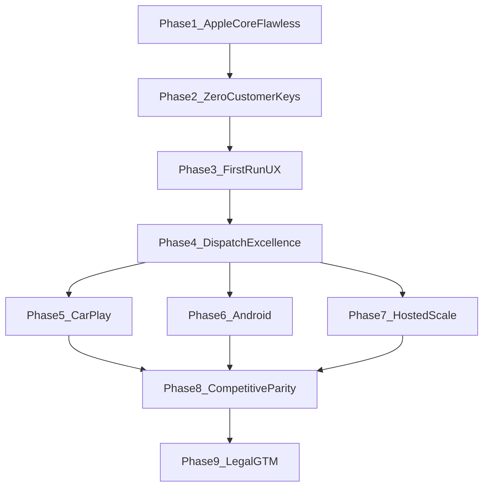

# RouteFinder: Staged Product Completion Roadmap

## Honest answer to your question

**You cannot get to “100% complete and above every competitor for any company any size” in a single build.** Competitors like CoPilot, TomTom hardware, and Sygic win on dimensions that require months of work: Android full navigation, production CarPlay, hosted multi-tenant portals, telematics/VU integration, TRAVIS parking commerce, and planet-scale offline.

**What you CAN do in stages:** finish a product that is **genuinely superior for UK small fleets on Apple** (your wedge), then expand platform-by-platform until you credibly beat alternatives on your target ICP—and only then touch legal, pilots, or App Store.

**Legal, trademark, solicitor, and pilot outreach are deferred to Phase 9** per your instruction.

---

## What is already shipped (audit sprint — verify first)

Before Phase 1, confirm these exist locally (they were implemented in the prior session; commit if not pushed):


| Feature                  | Key paths                                                                                                                                                                                            |
| ------------------------ | ---------------------------------------------------------------------------------------------------------------------------------------------------------------------------------------------------- |
| Fleet Setup Wizard       | `[FleetSetupWizardView.swift](RouteFinder/Sources/UI/Components/FleetSetupWizardView.swift)`                                                                                                         |
| QR generate / scan       | `[VehiclePairingQRView.swift](RouteFinder/Sources/UI/Components/VehiclePairingQRView.swift)`, `[FleetVehicleQRScannerView.swift](RouteFinder/Sources/UI/Components/FleetVehicleQRScannerView.swift)` |
| ORS route proxy (server) | `[FleetORSProxy.swift](RouteFinder/Sources/FleetServerCore/FleetORSProxy.swift)`                                                                                                                     |
| ORS route proxy (client) | `[FleetORSRoutingFactory.swift](RouteFinder/Sources/RouteController/FleetORSRoutingFactory.swift)`                                                                                                   |
| Hide ORS for fleet users | `[SettingsSheet.swift](RouteFinder/Sources/UI/Design/SettingsSheet.swift)`, `usesFleetORSProxy` in `[RouteViewModel.swift](RouteFinder/Sources/UI/RouteViewModel.swift)`                             |
| Web dispatch v1.5        | `[web-dispatch/src/App.tsx](web-dispatch/src/App.tsx)`, `[TripMapPreview.tsx](web-dispatch/src/TripMapPreview.tsx)`, `[VehicleQR.tsx](web-dispatch/src/VehicleQR.tsx)`                               |
| Operator guides          | `[Docs/web-dispatch-operator-guide.md](Docs/web-dispatch-operator-guide.md)`, updated `[getting-started.md](Docs/getting-started.md)`                                                                |


**Known gap still open:** geocoding still hits HeiGIT **directly** via `[OpenRouteServiceGeocoder](RouteFinder/Sources/RouteController/OpenRouteServiceGeocoder.swift)` in `RouteViewModel` — drivers without a local ORS key can route via proxy but **cannot search addresses** until Phase 2.

**Not built yet:** first-launch **role picker** (Driver / Dispatcher / Office PC) from the original audit plan.

---

## Definition of “done” at each level




| Level         | You can honestly claim                                                                                    |
| ------------- | --------------------------------------------------------------------------------------------------------- |
| After Phase 4 | Best UK small-fleet HGV app on Apple + LAN dispatch; strangers self-serve; operator pays all routing APIs |
| After Phase 5 | + production CarPlay (requires paid Apple Developer Program)                                              |
| After Phase 6 | + Android drivers (C1 receive, then C2 full nav)                                                          |
| After Phase 7 | + remote offices without LAN (hosted relay/gateway)                                                       |
| After Phase 8 | Competitive parity on tolls, telematics read-only, parking partners where buildable                       |
| After Phase 9 | Commercially shippable (legal, pilots, pricing)                                                           |


---

## How to use this plan

1. Run **one phase at a time** — paste the phase prompt into a new chat.
2. Do **not** start the next phase until the **exit gate** passes (agent runs tests; you run the device checklist).
3. Say **“Do NOT edit the plan file”** in each prompt (your standing rule).
4. Commit after each phase passes its gate.

---

## Phase 1 — Apple core: zero errors, CI green, device QA

**Goal:** iPhone + Mac dispatch are bug-free, CI always green, fleet LAN E2E proven on real hardware.

**Scope:**

- `swift test`, fleet E2E smoke, iOS UI tests, `web-dispatch` build
- Fix any regressions from audit sprint
- Physical iPhone sign-off for C3–C9 in `[phase20-verification.md](Docs/phase20-verification.md)` (walkaround PDF, layby voice, fuel card, hazards, roadworks, TomTom live)
- Mac ↔ iPhone fleet Part B per `[fleet-e2e-qa.md](Docs/fleet-e2e-qa.md)`
- Update `phase20-verification.md` with Pass/Fail per scenario

**Exit gate:**

- GitHub Actions `macos`, `ios`, `web-dispatch` jobs green
- You mark C3–C9 Pass or file specific bugs for agent fix loop
- Fleet push → toast → route → rehearse → walkaround → dispatch PDF works on your Wi‑Fi

**Agent prompt (copy-paste):**

```
Phase 1 — Apple core hardening. Do NOT edit any plan file.

Goal: zero build/test failures; fix fleet/QR/proxy regressions; complete physical device QA sign-off for phase20 C3–C9 and fleet Part B.

1. Run swift test, fleet-e2e-smoke.sh, web-dispatch npm test && npm run build.
2. Fix any failures in FleetSetupWizard, VehiclePairingQR, FleetORSProxy, RouteViewModel usesFleetORSProxy.
3. Add/adjust tests only where they catch real regressions.
4. Update Docs/phase20-verification.md with results template for C3–C9.
5. Give me an exact 30-minute device checklist (Mac fleet server --ors-key, iPhone wizard, push trip, rehearse, walkaround, dispatch PDF).

Do not touch legal docs or pilot outreach. Commit only if I ask.
```

**You verify:** Run the device checklist on real iPhone + Mac.

---

## Phase 2 — Zero customer API keys (routing + geocoding)

**Goal:** Driver with fleet wizard paired never needs HeiGIT key for **search or route**.

**Scope:**

- Extend `[FleetORSRoutingFactory](RouteFinder/Sources/RouteController/FleetORSRoutingFactory.swift)` (or sibling) to build geocoder targeting `GET /v1/proxy/pelias/v1/search` on fleet server (`[FleetORSProxy.swift](RouteFinder/Sources/FleetServerCore/FleetORSProxy.swift)` already exposes this)
- Wire `[RouteViewModel](RouteFinder/Sources/UI/RouteViewModel.swift)` geocode path to use fleet proxy when `usesFleetORSProxy`
- Optional: TomTom Traffic Flow proxy on fleet server (`--tomtom-key`) for operator-paid traffic
- Integration test: fleet server with mock or recorded ORS responses
- Update cloud banner / Settings copy: “Search and routing included with fleet plan”

**Exit gate:**

- Fresh iPhone: fleet wizard only, **no** ORS key saved → geocode Norwich → Find route → success
- `GET /v1/proxy/status` shows metering incrementing
- CI green

**Agent prompt:**

```
Phase 2 — Complete operator-paid APIs (geocode + optional TomTom). Do NOT edit any plan file.

Drivers paired to fleet server must geocode AND route without a local HeiGIT key.

1. Fleet server already has /v1/proxy/ors/v2/* and /v1/proxy/pelias/v1/search — wire OpenRouteServiceGeocoder (or factory) to use fleet proxy base URL when usesFleetORSProxy, same auth as FleetORSRoutingFactory.
2. Update RouteViewModel geocode/search to use proxied geocoder.
3. Optional: add --tomtom-key fleet proxy for traffic sampling if straightforward.
4. Tests for proxy geocode URL construction and hasCloudRoutingCapability without local key.
5. Update Docs/fleet-setup-guide.md and Settings copy.

No legal/pilot work. Give me verification steps: server with --ors-key, iPhone wizard only, search + route without Settings API key.
```

---

## Phase 3 — First-run UX: stranger-ready in 5 minutes

**Goal:** New user immediately knows their role and what to do—no Terminal docs.

**Scope:**

- **Role picker** on first launch after auth: Driver (iPhone) / Dispatcher (Mac) / Office PC (link to web guide)
- Driver path → vehicle mode → fleet wizard (if fleet) or solo routing hint
- Dispatcher path → “start fleet server” inline instructions + open Dispatch console
- Office path → show LAN URL + link to `[web-dispatch-operator-guide.md](Docs/web-dispatch-operator-guide.md)`
- Android C1: mirror wizard steps + QR scan in `[android-fleet-driver/](android-fleet-driver/)`
- Product onboarding already mentions fleet (`[ProductOnboardingSheet.swift](RouteFinder/Sources/UI/Components/ProductOnboardingSheet.swift)`) — align copy

**Exit gate:**

- You hand a colleague an iPhone with no prior context; they complete driver setup in under 5 minutes with QR
- Windows colleague opens web dispatch tour and pushes a trip without asking you questions

**Agent prompt:**

```
Phase 3 — First-run role picker and cross-device onboarding. Do NOT edit any plan file.

Implement the missing audit item: unified Getting Started role picker (Driver / Dispatcher Mac / Office PC) on first launch after auth.

1. SwiftUI RolePicker or LaunchRoleSheet persisted in NavigationWorkspaceSettings.
2. Driver: vehicle mode → fleet setup wizard entry (or solo ORS hint if no fleet).
3. Dispatcher Mac: fleet server one-liner + open DispatchConsoleView.
4. Office PC: display LAN URL pattern and web-dispatch-operator-guide summary (in-app on Mac/iPad or deep link text).
5. Android C1: FleetSetup-style screens — discover URL, test, paste/scan vehicle UUID, trip receive UI polish.
6. GlassmorphicModifiers throughout. iOS camera permission already in Info.plist.

Exit: stranger test paths documented in Docs/getting-started.md. CI green. No legal work.
```

---

## Phase 4 — Dispatch excellence (beat CoPilot on desk UX)

**Goal:** Office dispatch is clearly better than per-seat fleet SaaS for ≤20 trucks on LAN.

**Scope:**

- Web dispatch: **geocode stop search** (via fleet pelias proxy), not just demo coords
- Live **driver snapshot** panel on Mac dispatch (not only web): physics ETA, status, inspection summary from `FleetTripSnapshot`
- **Periodic GPS** on snapshot (lat/lon + timestamp) → dispatch map pin (Mac + web)
- Fleet server: optional **TLS guide** in docs; Bonjour + manual URL parity
- macOS: helper to surface “fleet server running?” in Dispatch UI (status dot)
- Web: production `npm run build` static hosting instructions for office LAN

**Exit gate:**

- Push trip from web with geocoded stops (not hardcoded Norwich)
- See driver pin update on map when iPhone navigates (snapshot poll)
- Mac dispatch shows same snapshot + defect card

**Agent prompt:**

```
Phase 4 — Dispatch console excellence. Do NOT edit any plan file.

Make LAN dispatch clearly superior for small UK fleets.

1. Web dispatch: geocode search for trip stops via fleet /v1/proxy/pelias/v1/search.
2. Add periodic GPS fields to FleetTripSnapshot (Contracts + server + iOS publish + Android C1 publish).
3. Mac DispatchStatusPanel + web: show live pin from latest snapshot on map.
4. Dispatch UI fleet-server health indicator (is /health reachable).
5. Docs: TLS/VPN for remote office, static web-dispatch hosting on LAN.
6. Tests for snapshot GPS round-trip.

No legal/pilot. CI green. Give me Mac+iPhone+web verification script.
```

---

## Phase 5 — CarPlay production (requires your Apple Developer Program)

**Goal:** CarPlay matches Sygic/TomTom in-cab experience for entitled builds.

**Blocker:** Paid Apple Developer Program (~£99/yr). Personal team builds strip CarPlay entitlements per `[carplay-weatherkit-restore.md](Docs/carplay-weatherkit-restore.md)`.

**Scope:**

- Restore entitlements on paid team
- Device QA on real CarPlay head unit or simulator
- Voice coexistence, route progress templates, fleet trip handoff smoke
- Document build/signing steps

**Exit gate:**

- CarPlay route runs on physical device with paid-team build
- `phase20-verification.md` CarPlay section Pass

**Agent prompt:**

```
Phase 5 — CarPlay production restore. Do NOT edit any plan file.

I have (or will have) a paid Apple Developer Program account. Restore CarPlay entitlements per Docs/carplay-weatherkit-restore.md, fix any CarPlayUI issues, add device QA checklist, ensure fleet-routed trips work in CarPlay session.

Assume entitlements file RouteFinderApp.entitlements needs paid-team profiles. Run CarPlayUITests. No legal work.
```

**You must:** Enroll in Apple Developer Program before starting this phase.

---

## Phase 6 — Android platform (C1 polish → C2 full navigator)

**Goal:** Mixed iOS + Android fleets work; Android drivers get full HGV nav (not just trip receive).

**Stage 6A — C1 polish (weeks):** onboarding, QR, SSE reliability, CI job for `android-fleet-driver` assembleDebug

**Stage 6B — C2 navigator (months):** per `[android-c2-gate.md](Docs/android-c2-gate.md)` but **you are deferring pilot gate** — build when Phases 1–4 are perfect:

- MapLibre Native + fleet ORS proxy client (Kotlin)
- HGV routing, voice TBT, physics rehearsal port or shared API
- Android Auto deferred until C2 stable

**Exit gate 6A:** Android receives trip from web push on LAN
**Exit gate 6B:** Android finds HGV route via fleet proxy without user ORS key

**Agent prompt 6A:**

```
Phase 6A — Android C1 polish. Do NOT edit any plan file.

Polish android-fleet-driver: fleet setup wizard parity with iOS, QR UUID entry, onboarding, connection health, CI assembleDebug job in .github/workflows/ci.yml. No full navigator yet.
```

**Agent prompt 6B:**

```
Phase 6B — Android C2 full HGV navigator. Do NOT edit any plan file.

Build full Android HGV navigation using fleet ORS proxy (no customer keys): MapLibre Native map, ORS routing via office fleet server, metric voice TBT, trip receive integration, Driver Terms screen. Port physics rehearsal incrementally. Match iOS fleet wizard flow. This is a large phase — implement MVP nav first, then rehearsal.
```

---

## Phase 7 — Hosted scale (remote offices, “any depot”)

**Goal:** Depots without LAN can still dispatch; operator API keys stay on your infrastructure.

**Scope:**

- Minimal **hosted fleet relay** or **API gateway** (Cloudflare Worker / VPS): auth token per org, proxies ORS/TomTom, forwards fleet REST/SSE
- Web dispatch + apps point at `https://api.yourdomain` instead of LAN IP
- Per-org metering (extend `FleetProxyUsageMeter` to disk/redis)
- Not full multi-tenant SaaS admin UI yet — config via env/tokens

**Exit gate:**

- Driver on cellular + VPN (or hosted relay) receives trip and routes without LAN
- Operator rotates one API key on server; fleets never see it

**Agent prompt:**

```
Phase 7 — Hosted API gateway and fleet relay. Do NOT edit any plan file.

Build minimal hosted layer so remote depots work without office LAN: HTTPS gateway proxying fleet REST/SSE and ORS/Pelias with operator keys, per-org bearer tokens, persisted metering. Update iOS/web/Android to accept hosted base URL. Document deployment (single VPS or Cloudflare Worker). No billing UI yet.
```

---

## Phase 8 — Competitive parity extras (selective)

**Goal:** Close remaining gaps that block “better than everything” pitches **without** building telematics empires.

**Build (in priority order):**

1. Toll awareness / tariff hints (UK-first, authored data)
2. Telematics **read-only** import (Geotab/Samsara CSV or webhook stub — not VU download)
3. TRAVIS/SNAP parking **deep link** (not booking commerce — partner redirect)
4. Offline pack UX polish (download progress, region picker)
5. HD lane guidance improvements (Overpass enrichment already exists — deepen)

**Do NOT build:** legal cadastral LEZ, planet PBF in-app, full ELD compliance

**Exit gate:**

- Updated `[competitive-gap-matrix.md](Docs/competitive-gap-matrix.md)` shows closed gaps
- Scorecard re-run documenting wins vs Sygic/CoPilot/TomTom for your ICP

**Agent prompt:**

```
Phase 8 — Competitive parity extras. Do NOT edit any plan file.

From Docs/competitive-gap-matrix.md, implement highest-impact parity items without over-engineering: UK toll hints, telematics read-only stub, parking partner deep links, offline pack UX, lane guidance depth. Update competitive-feature-scorecard.md with honest before/after. No legal/pilot.
```

---

## Phase 9 — Legal and commercialization (only when YOU say product is ready)

**Goal:** Ship commercially after Phases 1–8 pass your personal “100% working” bar.

**Scope:** `[legal/operator-legal-checklist.md](Docs/legal/operator-legal-checklist.md)`, solicitor review, trademark, hosted Privacy/ToS URLs, App Store Connect, pilot pack, Norfolk outreach

**You explicitly deferred this until now.**

**Agent prompt:**

```
Phase 9 — Legal and GTM (I confirm product is complete). Do NOT edit any plan file.

Wire legal docs into app and App Store metadata, finalize pilot-fleet-pack pricing with API-included subscription, update operator-legal-checklist, prepare pilot-outreach Norfolk sends. I will execute solicitor/trademark myself; you prepare drafts and in-app links only.
```

---

## What to skip / not promise until the relevant phase


| Claim                                | Wait until                   |
| ------------------------------------ | ---------------------------- |
| “No API keys ever”                   | Phase 2 (geocode) complete   |
| “Stranger-ready in 5 min”            | Phase 3                      |
| “See trucks on the map”              | Phase 4                      |
| “CarPlay in production”              | Phase 5 + paid Apple account |
| “Android drivers navigate”           | Phase 6B                     |
| “Remote depot without LAN”           | Phase 7                      |
| “Beat CoPilot on parking/telematics” | Phase 8 (partial)            |
| “Ready to sell”                      | Phase 9                      |


---

## Immediate next step (today)

**Start Phase 1** — paste the Phase 1 prompt above. If the audit sprint changes are uncommitted, commit first:

```bash
cd /Users/admin/Developer/RouteFinder
git status
# if changes present:
git add -A && git commit -m "Fleet wizard, QR pairing, ORS proxy, web dispatch v1.5"
```

Then run Phase 1 agent work + your 30-minute iPhone/Mac smoke.

---

## Bottom line

- **Stages are mandatory** — “100% above all competition for any company” is Phases 1–8 over months, not one sprint.
- **Legal is last** — your call, Phase 9 only.
- **Each phase has a copy-paste prompt** — use them sequentially; do not skip exit gates.
- **Your wedge is winnable early:** after Phase 4 you already beat Sygic/CoPilot for Norfolk 5–20 truck iPhone fleets on physics rehearsal + operator-paid LAN dispatch.

