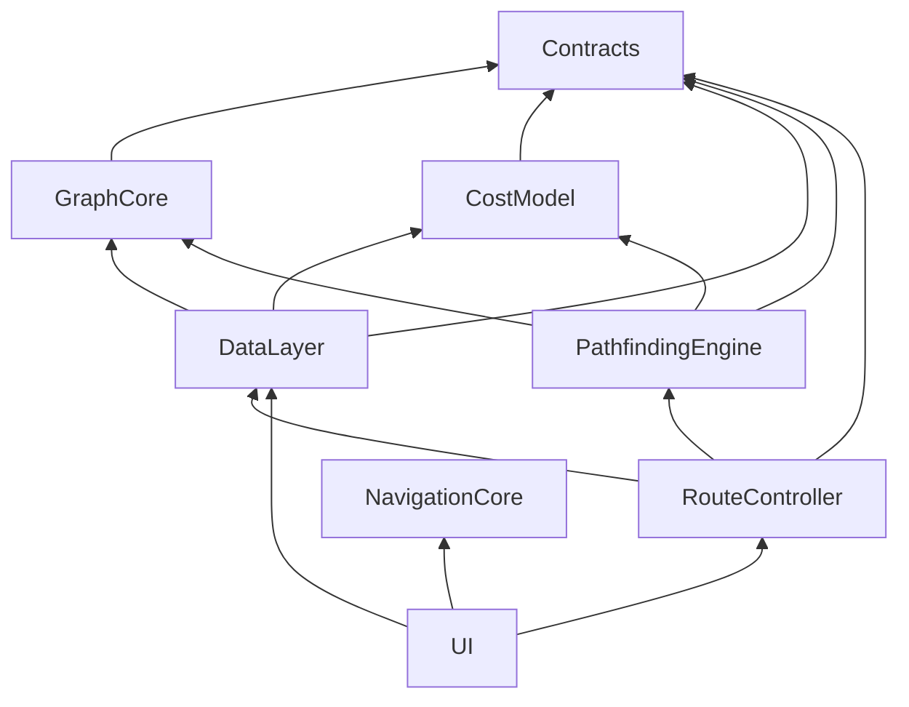
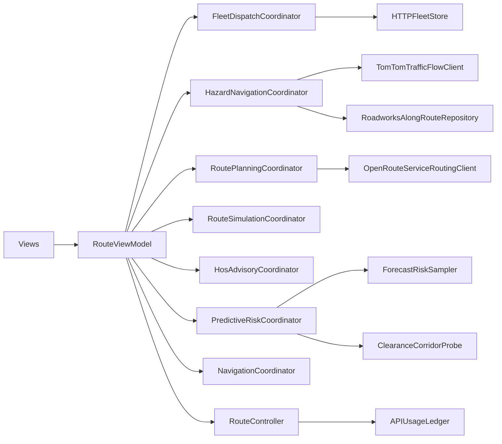

# Architecture

RouteFinder is organized as a Swift package with strict module boundaries and coordinator-based UI orchestration.

## Module dependency graph

**Rules**

1. **No HTTP from Views** — all remote I/O goes through `RouteController` or `DataLayer` clients.
2. **Contracts are pure** — models, formatters, and metering types only; no URLSession.
3. **Coordinators own orchestration** — fleet dispatch and hazard navigation are extracted from `RouteViewModel`.

## Coordinator pattern

| Coordinator | Responsibility | Host |
|-------------|----------------|------|
| `FleetDispatchCoordinator` | Poll/SSE dispatch, snapshot publish, Bonjour discovery, fleet store reload | `RouteViewModel` (`FleetDispatchHost`) |
| `HazardNavigationCoordinator` | TomTom sampling, roadworks corridor, crowd hydrate, hazard overlay/voice | `RouteViewModel` (hazard state + context) |
| `PredictiveRiskCoordinator` | Fuse kinetic / weather / hazard / roadworks / traffic / schedule / forecast / clearance into `RouteRiskAdvisory` + primary HUD | `RouteViewModel` (`PredictiveRiskProviding`) |
| `RoutePlanningCoordinator` | SearchResult mapping, LEZ avoid rings, recalculate debounce, lane enrichment, traffic reroute evaluation, route failure presentation | `RouteViewModel` (`RoutePlanningHost`) |
| `RouteSimulationCoordinator` | Simulation callbacks, kinetic advisories, physics ETA / rehearse, Break Now, layby voice announce | `RouteViewModel` (`RouteSimulationHost`) |
| `HosAdvisoryCoordinator` | HOS duty transitions, can-I-drive, tacho import/persistence, rest forecast, path metrics | `RouteViewModel` (`HosAdvisoryHost`) |

`RouteViewModel` remains the SwiftUI observation root. Coordinators hold logic; the view model holds `@Observable` state for bindings.

Supporting risk modules (not coordinators): `ForecastRiskSampler` (TomTom + OpenWeather 1–3h horizon), `ClearanceCorridorProbe` (Overpass maxheight/weight along route + off-route heading corridor).

## Remote reliability

`RemoteRequestPolicy` (`DataLayer/Networking`) centralizes timeout, retry, exponential backoff with jitter, and HTTP 429 / `Retry-After` handling for ORS, TomTom, fleet HTTP, and DVLA/RegCheck.

Structured logging uses `RouteFinderLog` categories: `routing`, `geocode`, `fleet`, `metering`.

## Target end-state

Future extractions: further thinning of settings / offline map orchestration only if `RouteViewModel` remains a merge hotspot.

## ADR: Incremental god-object decomposition

**Context:** `RouteViewModel` exceeded 3,500 lines with fleet, hazards, routing, simulation, HOS, and settings intertwined.

**Decision:** Extract by **domain boundary** (fleet, hazards) rather than by file size. Keep observation state on the view model; move async orchestration to coordinators with narrow host protocols.

**Consequences:** Fewer merge conflicts in fleet/hazard code paths; coordinator integration tests can run with `InMemoryFleetStore` and hazard fixtures without spinning up the full view model graph.
