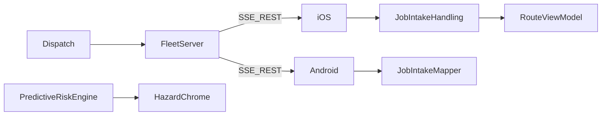

# Ultimate HGV platform specification

Last updated: 2026-09-27  
Scope: Engineering architecture and product capability — no legal/GTM.

RouteFinder is the **UK-first, cab-phone-first** all-in-one HGV driver + dispatch hub for **5–15 truck** independents (scale via hosted multi-depot). This document is the gap audit and target architecture for closing remaining “daily ops” gaps without rebuilding the stack.

---

## Competitive positioning

| Competitor class | RouteFinder today | Close next |
|------------------|-------------------|------------|
| Sygic / CoPilot / TomTom GO | **Lead** physics rehearsal, layby+HOS, LEZ avoid, stranger fleet ORS proxy | Lane HD, offline depth, hosted multi-depot |
| Samsara / Webfleet | **Lead** LAN + zero SaaS portal for ICP | Live telematics map (intentional stub) |
| Waze / Google Maps | **Lead** HGV constraints + CAZ | Crowd scale |

Evidence: [`engineering-benchmark-2026-09.md`](engineering-benchmark-2026-09.md), [`competitive-gap-matrix.md`](competitive-gap-matrix.md).

---

## Pillar status

### A — One-touch dispatch

| Capability | Status |
|------------|--------|
| SSE `tripPushed` + poll fallback | **Shipped** |
| Auto stops + profile + Find route | **Shipped** (iOS; Android C2) |
| `FleetJobBrief` (weight / ADR / time windows / auto flags) | **Shipped** — brief in trip PDF; late-ETA fuse (U7) |
| RegCheck on intake when plate known | **Shipped** — iOS + Android (username required) |

### B — Predictive risk

| Capability | Status |
|------------|--------|
| Kinetic rehearsal / grades / curves | **Shipped** |
| Live weather + TomTom + roadworks + hazard banners | **Shipped** (separate) |
| Unified `RouteRiskAdvisory` fuse (kinetic / weather / hazard / roadworks / traffic) | **Shipped** — live kinetic/weather + HUD primary banner (`predictiveRiskPrimaryBanner`) |
| 1–3h traffic forecast | **Shipped** (U8 iOS + U14 fleet proxy on iOS/Android; U11 Android) — `ForecastRiskSampler`; ledger-capped |
| Corridor + off-route clearance radar | **Shipped** (U9 + U11-B2) — `ClearanceCorridorProbe` on-route + heading corridor when off-spine |

### C — Compliance

| Capability | Status |
|------------|--------|
| EU 561 advisory HOS + tacho import | **Shipped** |
| DVSA walkaround + PDF + dispatch handoff | **Shipped** (iOS PDF; Android PDF + photos U12) |
| Defect photo attachments | **Shipped** (iOS PhotosPicker; Android gallery attach + size budget U12) |
| LEZ / CAZ avoid | **Shipped** (iOS ORS rings; Android ORS `avoid_polygons` U15 + advisory catalog) |

---

## API: `FleetJobBrief` (optional on `FleetTrip`)

JSON fields (omit = legacy client safe):

| Field | Type | Notes |
|-------|------|-------|
| `grossWeightKg` | number? | Applied to `VehicleProfile.weight` (tonnes) on intake |
| `adrClass` | string? | Mapped to `HazmatClass` when possible |
| `timeWindows` | `{ stopId, earliestArrival?, latestArrival? }[]` | Planning aid |
| `requestedVehicleProfileId` | UUID string? | Desk preference |
| `autoFindRoute` | bool | Default `true` |
| `autoRehearse` | bool | Default `false` |

SSE / REST continue to carry full `FleetTrip`; older clients ignore unknown keys.

---

## Architecture decisions

1. **SSE stays** — no WebSocket until cellular loss is proven in pilots (poll fallback exists).
2. **Contracts first** — `FleetJobBrief`, `JobIntakeHandling`, `RouteRiskAdvisory` / `PredictiveRiskEngine`.
3. **Fuse before forecast** — U3 MVP merges existing signals; no ML.
4. **Intentional non-parity** — telematics VU, planet PBF, Android Auto, toll tariffs (see gap matrix).

---

## Epics

| ID | Phase | Gate |
|----|-------|------|
| `EPIC-JOB-INTAKE` | U2 | **Done** — push with weight/ADR → auto-route iOS+Android; optional fields |
| `EPIC-PREDICTIVE-RISK` | U3 | **Done** — MVP fuse ≥3 kinds (`PredictiveRiskEngine`) + HUD + voice dedup |
| `EPIC-WALKAROUND-MEDIA` | U4 | **Done** — defect photos + PDF/fleet size guard |
| `EPIC-P0-DEVICE` / Android C2 / CarPlay | U5 | **Docs tied**; physical rows remain operator Blocked / Pending |

### Deferred Phase 2+ (not in MVP)

| ID | Deliverable |
|----|-------------|
| `EPIC-WEB-JOB-BRIEF` | web-dispatch time windows (**shipped** 2026-09-21) + schema sync |

### Phase 2 complete (2026-09-21)

| ID | Deliverable | Status |
|----|-------------|--------|
| U6 | Competitive / test-matrix doc sync | **Done** |
| U7 | `timeWindows` in trip brief + late-ETA fuse | **Done** |
| U8 `EPIC-PREDICTIVE-FORECAST` | TomTom + OpenWeather horizon advisories | **Done** |
| U9 `EPIC-CLEARANCE-RADAR` | Overpass maxheight/weight → `.clearance` | **Done** |
| U10 | Android RegCheck + fuse banner + walkaround snapshot | **Done** |
| U11 | Android time windows + forecast/clearance fuse; iOS off-route heading clearance | **Done** (2026-09-21) |
| U12 | Android walkaround camera + local PDF + richer snapshot handoff | **Done** (2026-09-22) |
| U13 | Android LEZ advisory + HOS clock + layby ahead | **Done** (2026-09-22 MVP) |
| U14 | Fleet TomTom / OpenWeather / Overpass proxy (zero driver forecast keys) | **Done** (2026-09-22) |
| U14b | Android off-route heading clearance | **Done** (2026-09-22) |
| U15 | Android ORS LEZ `avoid_polygons` (parity with iOS `LEZAvoidPolicy`) | **Done** (2026-09-22) |

### Operator-gated

| ID | Deliverable | Gate |
|----|-------------|------|
| CarPlay production QA | Paid-team signing + device rows | [`phase5-carplay-verification.md`](phase5-carplay-verification.md) |

---

## Non-goals

- Full multi-tenant SaaS billing UI  
- Remote VU download SDK  
- In-app planet PBF  
- Android Auto  
- Live toll tariff pricing  

---

## Related

- [`architecture.md`](architecture.md)  
- [`phase20-verification.md`](phase20-verification.md)  
- [`phase6b-android-nav-verification.md`](phase6b-android-nav-verification.md)  
- [`phase5-carplay-verification.md`](phase5-carplay-verification.md)  
